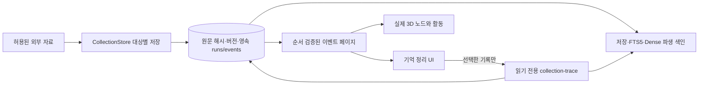

# 2026-10-11 — 수집 저널 커서, 현재 근거 재조회와 과거 버전 보존

기준점: PR #29의 커밋 `69cc1c4fe69318067c0aff81bf24dce268ebb959`.
새 변경은 `codex/alden-activity-order-20261011`에 별도 누적한다.
PR #27/#28/#29, 원래 Mac 복제본, 운영 DB, 모델, 설정·전송 큐 및
현재 프로세스는 이 GitHub 소스 작업에서 수정하지 않는다.

## 구현된 데이터 계약

1. `desktop/src/knowledge/collection-activity.ts`: 현재 스트림 ID와
   커서를 기준으로 허용된 200개 이하의 이벤트 페이지를 전체 검증한다.
   이벤트 시퀀스 역전·중복 ID·잘못된 타입·유효한 커서보다 뒤의 이벤트는
   **한 항목도 적용하지 않고** 현재 커서로 재조회한다. 검증 후에만
   `seen`, `pending`, `committed` 상태를 갱신한다.
   사용자가 화면을 숨겼거나 이벤트가 10초 표시 TTL을 넘기면
   과거 이벤트를 방금 저장된 지식처럼 점등하지 않는다.
2. `desktop/src/collection-history.ts`: 첫 페이지와 과거 페이지는
   `DESC`, 증분 페이지는 `ASC` 순서를 요구한다. 잘못된 행이 섞이거나
   순서가 뒤집히면 기존 목록·집계·커서가 그대로 남고, 같은 범위를
   다시 읽는다. 복구할 수 없는 페이지를 임의 삭제/영구 처리했다고
   표시하지 않는다. `revised`·`added`·`unchanged`·`removed`·
   `relations_changed`를 구분하고 요약에서 제외/관계 변경도 센다.
3. `scripts/alden_collection.py`: `stored` 개정 이벤트에 같은 수집
   대상의 `previous_version`을 연결한다. 같은 이름/원본 ID가 다른
   대상에도 있더라도 그 대상의 버전을 변경 전 근거로 사용하지 않는다.
   기존 `run_id`, event ID, 영속 카운트·체크포인트 계약은 유지한다.
4. 사용자가 이력 상세를 여는 경우에만 `collection-trace`로 정확한
   `projects`·`document_id`·`target_id`·`expected_version`을
   전달한다. 결과의 프로젝트·대상·버전·실행 ID가 모두 일치하면
   원본 SHA-256 확인, 저장 확정, FTS, Dense 저장 벡터 바인딩을
   각각 표시한다. 모델이 실제 추론에 사용됐거나 화면이 실제 GPU로
   렌더링됐다고 주장하지 않는다. 후속 개정, 권한 변경, 원본 제외,
   조회 실패를 구별한다. 상세 조회는 새 수집 이벤트를 만들지 않는다.
5. 화면 숨김·범위 변경·저널 교체·늦게 도착한 다른 기록의 결과를
   현재 상세에 반영하지 않는다. 동시에 같은 원본을 펼친 요청은
   진행 중인 하나의 읽기를 공유하며, 완료 뒤 캐시를 영구 고정하지
   않아 다음 열람 시 현재 버전을 다시 확인할 수 있다.

## 검사 범위

- 초기 UI 검증 [GitHub Actions 38070079466](https://github.com/twoimo/alden/actions/runs/38070079466):
  활동/이력 역전 복구까지 macOS UI **467개 통과** 및 TypeScript/Vite 빌드 성공.
  앞선 실패 실행은 표시 TTL을 넘긴 테스트 시계의 오류로 구분하며
  실제 실패 로그를 지우지 않았다.
- 상세 근거와 이전 버전 추가 후
  [GitHub Actions 38070565014](https://github.com/twoimo/alden/actions/runs/38070565014):
  Python 60개, UI 470개, 타입·번들 빌드 통과. 최초 재검사에서
  TypeScript nullable guard 미비로 빌드 실패한 로그는 보존하고
  null 명시 검사 후 성공한 결과를 별도로 연결했다.
- 최신 표시 및 집계 검증은 코드 해시가 고정된 CI 실행에
  연결한 뒤 결과를 기록한다. UI DOM 검사와 사용자의 Mac 실물
  화면/GPU/입력·전체 설치본은 독립 검증이다.
- 자체 MCP `alden_knowledge_trace`의 저장 근거 경로는
  [이전 실제 stdio 테스트](alden-pipeline-readback-20261011.md)에서
  확인했다. 외부 `osk-system` 서버를 실제 조회한 증거가
  아니며, 동일 구분을 유지한다.

## 배포 및 복구 조건

작업 Mac의 `goal-objective.md`와 기존 `outputs/STATUS.md`는
Core/Codex 도구에 필요한 유효한 `turn_token`이 현재 대화에
제공되지 않았고 Desktop Computer Use 연결도 노출되지 않아
원문을 직접 열거나 원격 소스를 그 위치에 덮어쓸 수 없었다.
PR #27 → PR #28 → PR #29 → 이 브랜치의 변경 계보를
확인하되 원본 복제본과 미커밋 편집을 실제 비교하기 전에는
병합·설치·서비스 재시작을 실행하지 않는다.

기존 unsigned 0.3.58 arm64 앱 검증 빌드의 커밋
`c494a53c5ab649f49239e819fa1cc3ba13c6b9fd`는
**이번 새 이력 소비 및 재조회 변경 전**의 버전이다.
최신 코드를 반영한 설치본·실물 사용 확인과
Developer ID 서명·공증, 운영 MCP 호스트별 검증, 물리 음성/MLX
로드와 자원 지연은 여전히 미완료다.
