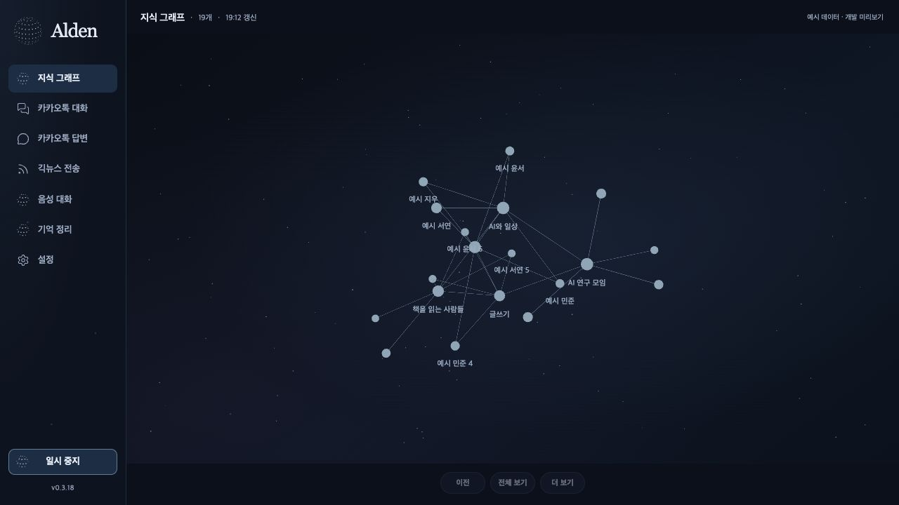

# Alden 0.3.18: 연결 성도와 노트 읽기

기본 화면은 작은 기억 노드와 실제 연결선으로 이루어진 우주 성도다. 노드를 클릭하면 전체 맥락을 유지한 채 옆에 노트를 연다. 연결된 노트를 누르면 정확한 ID로 이동하며 이전 탐색으로 돌아갈 수 있다. 좁은 창에서는 그래프와 노트를 세로로 배치하고 각각 읽을 수 있게 했다. 원문 근거는 펼쳐 읽는다.

[Obsidian 공식 그래프 설명](https://help.obsidian.md/plugins/graph)의 노드·연결·선택 강조와 전체/로컬 탐색을 참고했다. 기본 노드 크기는 실제 고유 이웃 수로 정하고 유형별 강제 배치를 하지 않는다. 큰 고정 원은 기본 화면에서 제거했다. 배경 별은 장식이며 ID·관계·선택 대상이 아니다.

## 실제 데이터와 예산

OSK의 저장 노트·공간·출처·시간·안정적인 ID를 바꾸지 않는 표시 변경이다. 계정이 포함된 방 ID를 완전하게 유지하며 같은 번호의 다른 계정을 합치지 않는다. 실제 SDK·Raw 재구성 근거는 [앞선 OSK 검증](alden-osk-context-20261004.md)에 있다. UI 통과가 모든 지식의 정확성이나 생물학적 학습 성공을 의미하지 않는다.

전체 보기는 최대 120개 기억·512개 연결 묶음, 로컬 탐색은 최대 24개 기억·144개 묶음이다. 초과하는 독립 기억은 다음 보기에서 접근한다. 클릭 자체는 전체 그래프를 유지하며 ‘연결 보기’가 로컬 탐색을 시작한다. 노드·간선·물리 버퍼는 유지하고 매 프레임 다시 만들지 않는다. 숨김·닫기·잠김·비상 중지·동작 줄이기의 기존 게이트를 유지한다.

## 확대와 물리 표현

로컬 탐색에서 더 확대할 때만 뉴런의 세부 형태를 표시한다. 세포체와 분기 구조는 기억 ID에 따른 일정한 표시 형태다. 15개 연결점은 최종 렌더링 geometry의 실제 가지 끝 정점에서 얻는다. 관계마다 선택한 연결점을 유지하고, 양쪽 세포가 움직이거나 관계가 철회되는 동안에도 연결이 그 정점을 따라간다.

돌기의 길이·성장 말단·접촉 틈·수축은 같은 관계별 상태 g를 사용한다. g ← g + (1-exp(-dt/0.24))·(target-g), target은 표시할 관계이면 1, 철회하면 0이다. 성장 원뿔의 펼침은 smoothstep(0,0.15,g)·(1-smoothstep(0.8,1,g))로, 형성 후 접힌다. 이는 초 단위 UI 전이이며 생물학적 시간이 아니다. 노트 열기와 확대에서 이미 있던 관계가 드러나는 전이를 새 학습으로 주장하지 않는다. 수렴하면 렌더 루프를 멈춘다.

[참고 쇼츠](https://www.youtube.com/shorts/LzF8Eoiv2bg)는 브라우저에서 일시정지하고 1/30초 단위로 이동했다. 14개 주요 장면과 접촉 부근 연속 8프레임을 직접 확인했다. 모든 420여 프레임을 판독한 것은 아니다. 영상의 원본·캡처는 저장소나 배포물에 포함하지 않는다. [Trachtenberg et al., 2002 원논문](https://www.mcgill.ca/brianchenlab/files/brianchenlab/14-trachtenberg-nature-2002.pdf)은 안정적인 가지와 가시의 생성·제거를 구분한다. [Matsuzaki et al., 2004](https://www.nature.com/articles/nature02617)는 선택적인 가시 크기 변화를 다룬다. 영상의 설명을 검증된 생물학적 측정으로 대신하지 않는다.

## 긱뉴스

참고 채팅방은 원본 로컬 DB에서 제목으로 확인하고 저장된 메시지 512개를 읽었다. 공개한 것은 구성 방식뿐이며 개인 대화·대상·내용을 복제하지 않는다. 공식 Atom에서 나온 제목, 선택적인 짧은 원문 요약, 정식 topic 링크를 번호별 블록으로 전달한다. 제목 140자·요약 90자·전체 1,500자 상한, 중복 ID 제거와 URL 검증을 적용했다. 인사·날씨·근거 없는 의견이나 새 모델 호출은 추가하지 않았다.

TOP5와 헤더/항목 사이 한 줄 간격, 세 KST 슬롯, 기존 대상·승인·확인 후 seen/slot 저장 규칙을 유지한다. 실제 전송을 시험하지 않았다. 실행 중인 기존 worker의 코드 교체·재시작과 새 설치본의 기능은 별도 상태다.

## 검증 경계

최종 테스트·브라우저·네이티브 검사·설치 대조는 옆의 검증 JSON에 기록한다. 브라우저 이미지는 명시적인 합성 예시다. 네이티브 검사는 실제 저장 그래프를 읽는 별도 검사 인스턴스이며 상시 primary 메뉴바 입력·물리 음성/잠금·Retina·실제 전송·Dot 호출·공증/프로덕션을 증명하지 않는다. Developer ID 공증 자격 증명과 전체 목표의 남은 작업은 보존한다.

[측정·검증 JSON](alden-constellation-reader-20261004/verification.json). 실제 저장 그래프와 노트 패널 이미지는 개인 자료가 포함되어 별도 로컬 증거에만 보관한다.
