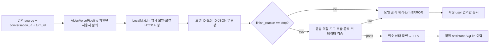

# Alden 로컬 음성 모델 완료 확인과 턴 격리 — 2026-10-11

## 변경 계보·안전 경계

- 기준: 미병합 PR #30, `c62d6b7763a6644151aa18ff3a4edc7f239e3821`. 상위 스택은 #29 → #28 → #27.
- 독립 구현 브랜치: `codex/alden-voice-completion-fence-20261011`.
- 원본 Mac 작업 복제본, 운영 대화·DB·모델·전송 큐·설정·프로세스는 이 원격 소스 변경의 대상이 아니다.
- **Tauri v2·Three.js, 로컬 MLX inference endpoint allowlist, 모델 선택과 기존 Gemini 라우팅을 바꾸지 않는다.** 로컬 서비스가 미준비이면 클라우드로 자동 전환하지 않는다.

## 실제 런타임 변화

`scripts/alden_voice.py::LocalMlxLlm`:
- JSON과 SSE에 대해 중복 키, NaN/Infinity와 지수 오버플로를 거부한다. 단일 assistant 답변을 요구하며 잘못된 역할·여러 choice를 거부한다.
- SSE에서 `[DONE]`만 받은 경우나 `finish_reason`이 없는 경우를 완료로 간주하지 않는다. `stop` 이외의 `length`, `tool_calls`, `content_filter`, 알 수 없는 상태를 저장/발화하지 않는다. `length`는 기존 `local_llm_reply_truncated`를 유지한다.
- 종료 뒤 다른 content나 추가 종료 이벤트를 받으면 중복/역전 응답으로 판정해 거부한다. 정상 완료 뒤 `choices=[]`인 별도 usage frame만 허용한다.
- 명시적인 error·failed·incomplete·cancelled 상태가 유효한 글자·`stop`과 함께 오더라도 실패로 처리한다.
- 로컬 MLX `/models`에서 **선택한 모델이 준비되었다고 표시되는지** 확인하는 기존 계약, per-turn request_id 및 conversation/turn/context 헤더, CPU/GPU aggregate `/metrics` 읽기, emergency latch와 cancel guard는 유지한다. 이것이 사용자의 Mac에서 실제 모델 로딩을 확인했다는 뜻은 아니다.
- 모델 오류는 `AldenVoicePipeline`에서 `generation_error`로 표준화하여 외부 서비스의 임의 메시지나 미완료 답변을 사용자에게 전파하지 않는다. 확인된 사용자 입력은 이력에 남지만, TTS가 호출되지 않은 결과는 assistant 이력으로 저장하지 않는다.

`tests/test_alden_voice_completion.py`는 진짜 `AldenVoicePipeline.process_text`, `LocalMlxLlm`, `AbortToken`, `alden_history.database`를 결합한다. 네트워크/음성 하드웨어만 고정 전송 mock으로 대체하고, 잘못된 응답에서 TTS 호출 횟수=0, assistant 행 수=0, 사용자 입력 보존, 중복 입력의 재게시 차단, 다음 새 턴의 정상 완료를 검사한다. 기존 유닛의 정상 mock에 명시적 `finish_reason=stop`을 넣어 미완료 데이터로 성공을 주장하지 않는다.

## 실제 검증과 증거 범위

[GitHub Actions macOS #38072168914](https://github.com/twoimo/alden/actions/runs/38072168914): 집중 음성·취소·모델 라우트 **66/66 통과**.

확장 [GitHub Actions macOS #38072362981](https://github.com/twoimo/alden/actions/runs/38072362981),
정확한 CI SHA `b83ac5c34481ac827fa75a5862245658bb393e38`:
**175개 중 169개 통과, 6개 skip(해당 CI Python에 NumPy 없음)**.
검증한 모델/테스트 코드의 Git blob SHA는 독립 구현 브랜치와 동일하다.
초기 실패 실행 `38072109129`, 확장 첫 실패 실행 `38072289600`은 폐기하지 않고 보존한다. 이전 mock이 미완료 응답을 정상으로 취급한 차이를 설명하며 실제 운영 MLX 장애 횟수로 간주하지 않는다.

이 회차에 **실행하지 않은 항목**: 실제 27B/Flash-Next 가중치 로딩·리비전·양자화·GPU 메모리 적합성, 실제 마이크/스피커와 wake/TTS 억제·끼어들기 지연, macOS Tauri 배포본의 물리 UI 및 서명·공증, 사용자 운영 원본의 외부 osk-system MCP 연결. 추론 처리량과 CPU/GPU peak 비교값을 만들어내지 않는다.

## 지정 Mac 배포 전 복구 절차

1. 유효한 Codex Core `turn_token`이 외부 호스트로부터 전달된 뒤에만 `/Users/twoimo/.codex/attachments/1d528d6c-42be-4bd0-80a1-4883b96474ed/goal-objective.md`의 원문과 전용 복제본의 `outputs/STATUS.md`, `git status`, PR diff, 활성 프로세스를 읽는다. 현재 ChatGPT 세션에는 발급 토큰이 보이지 않는다.
2. 원본·작업 미커밋·DB/전송 큐·모델·런처 설정·설치 앱을 복구 가능한 형태로 보존하고, 병합 전에 PR #30 위 이 브랜치의 단일 기능 변경을 선택적으로 반영한다.
3. 기존 선택 모델에 **실제 로컬 MLX 모델 상태를 조회**하고 하나의 검증된 정상 답변과 length/content_filter/취소 반환에서 TTS·DB 이력의 중복/누락을 실물로 측정한다.
4. 동일 모델·동일 컨텍스트에서 지연, TTFT, 취소 후 출력, STT/TTS 소음 및 배터리/자원 부담을 비교한다. 서명 자격·공증 권한·배포 대상을 확인한 후에만 운영 앱을 전환한다.
