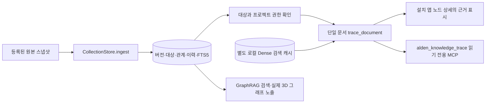

# Alden 지식 처리 단위별 증거 대사 — 2026-10-11

기준 원격 HEAD: PR #28 `1dfee9a13b1a7785a1f8534f2c1111286d036167`.
작업 브랜치: `codex/alden-pipeline-readback-20261011`.
원본 PR #27·#28과 Mac 작업 복제본, 실제 DB·메시지 전송 큐·LLM 설정은 이 브랜치에서 수정하지 않는다.

## 실제 연결 범위

- `scripts/alden_collection.py`: 한 번의 확정된 스냅샷 기록이 원본 ID,
  현재 대상별 버전, 활성 관계, FTS5와 `runs/events`를 같은 쓰기 트랜잭션에 반영한다.
  `A → 삭제 → A`로 이전 원문 리비전이 다시 등장하면 원본 순서가 새로운
  `snapshot-run` ID를 만들고 실제 멤버십과 관계를 되살린다.
  **동일 원본 순서 재전달**은 기존 확정 실행을 유지하므로 중복 이벤트를 만들지 않는다.
  과거 입력 리비전과 이전 원본 바이트는 보존한다.
- `scripts/alden_collection_retrieval.py::trace_document`: 하나의 허용된
  문서 ID, 프로젝트 집합, 선택한 대상과 기대 버전을 사용한다.
  **현재 허용된 멤버십이 없으면** 문서 존재 여부를 노출하지 않는
  `not_in_scope`을 반환한다. 낡은 기대 버전은 `version_changed`로
  종료한다. 원본 BLOB의 SHA-256, 해당 버전의 FTS5 텍스트,
  확정된 `runs/events` 단계 및 활성 관계의 두 끝점을 각각 대사한다.
  일반 검색이나 모델 생성 요청을 만들지 않는다.
- Dense 경로는 별도의 파생 `retrieval.sqlite3`를 **읽기 전용**으로 연다.
  보관된 원문에 해당하는 텍스트·해시·encoder 프로필·벡터 길이·유한값·정규화
  조건이 충족되어야 `stored_vector_binding_verified`이다.
  이 값은 **로컬 임베딩 모델 현재 로딩/추론 성공과 무관한 저장 바인딩 확인**이다.
  FTS만 확인됐다면 Dense는 `not_indexed` 또는 대기/불일치로 표시한다.
  서로 다른 SQLite DB가 하나의 원자적 스냅샷이라는 주장은 하지 않는다.
- `alden_knowledge_trace`: 기존 Alden 자체 stdio MCP의 허용 프로젝트
  시작 스코프 안에서 정확한 `document_id`를 조회한다. 도구 스키마는
  추가 필드를 거부하고 메시지 발신·원본 DB 쓰기·클라우드 추론을 하지 않는다.
  이는 **외부 osk-system MCP가 실제 연결되었다는 증거가 아니다.**
- 설치 앱: `collection-graph`의 선택 노드 상세를 읽을 때만 trace를 추가한다.
  노드 ID·`source_version`·`source_target`가 모두 일치해야 UI에
  저장/FTS/Dense 증거를 표시한다. 다른 대상이나 과거 선택의 응답은
  현재 상세에 붙이지 않는다. 사용자 표시 문구는 수집 상태·저장 바인딩과
  물리적 3D 렌더/AI 모델 사용을 명확히 구분한다.
  읽기 자체는 수집·저장 이벤트나 3D 시스템 점등을 새로 발생시키지 않는다.

## 테스트 실행과 반례

[macOS CI #38067548142](https://github.com/twoimo/alden/actions/runs/38067548142)
초기 실행에서 (1) 이미 처리한 원본 A의 재등장에 이전 `run_id`를
재사용하므로 복원이 누락되는 **실제 제품 결함**, (2) CI 러너에 로컬
임베딩 서버가 없는 **테스트 환경 결함**이 드러났다.
첫째는 원본 monotonic 순서를 실행 ID에 결합하여 수정했다.
둘째는 테스트 프로세스에서만 고정된 encoder 프로필과 결정적
3차원 벡터를 주입했다. 제품 서버·모델 설정은 변경하지 않는다.
실패 로그는 GitHub Actions에 그대로 보존한다.

후속 [macOS CI #38067729712](https://github.com/twoimo/alden/actions/runs/38067729712),
정확한 검증 SHA `e05f08e46249f0361a42181d2bf0a23d1dbbf110`:

| 범위 | 결과 | 검증 의미 |
| --- | --- | --- |
| Python 수집·스냅샷·GraphRAG·MCP·원본·OSK·모델 관련 | 112/112 통과 | 실제 저장소 코드 + 격리 fixture, 원 사용자 운영 자료 아님 |
| 3D 선택 근거·CollectionGraph·활동 소비 Vitest | 30/30 통과 | DOM·컨트롤러 검증, 물리 GPU 입력 아님 |
| `npm run build --prefix desktop` | 성공 | TypeScript 확인 및 Vite 번들 |
| 동일 저장 순서 replay·A→삭제→A·부정확한 원본 해시 | 통과 | 중복 억제·복원·fail closed |
| 권한 없는 프로젝트·다른 대상·오래된 버전 | 통과 | 문서 상세 및 MCP 혼입 차단 |
| 로컬 임베딩 서버 실물 로딩 | 미검증 | 테스트에만 고정 벡터를 사용 |
| 지정 사용자의 Alden 설치본·외부 osk-system | 미검증 | 유효한 Mac Core 세션 토큰 없음 |

## 설치 Mac에서 남은 수행 절차

1. 지정 복제본의 `git status`, `outputs/STATUS.md`, 현재
   PR #27·#28 및 별도 브랜치의 차이·설치본 SHA를 먼저 대조한다.
   미커밋 변경, 실행 중 서비스, 원본 DB·모델·전송 큐와 설정의
   복구 가능한 스냅샷을 확보한다.
2. 테스트 결과와 diff를 검토해 복제본 안에 안전하게 가져온 후
   사용자 등록 대상에서 한 개의 실제 자료로 완전/증분 수집을 실행한다.
   선택 노드 상세의 `pipeline_trace`, 자체 MCP 검색·history·trace 및
   osk-system 원문 재조회를 각각 실행해 동일 ID·버전·권한을 대조한다.
3. local MLX/임베딩/STT/TTS 및 물리 인터랙션은 독립적으로 측정한다.
   기준선과 TTFT, 지연 p50/p95, 그래프 FPS, 숨김 시 렌더 호출0,
   CPU/GPU/메모리·클라우드 추론 미우회를 실제 증거로 남긴다.
4. 설치 앱의 파일·번들·서명 및 기존 프로세스/설정을 설치 전후 비교해
   `outputs/STATUS.md`의 네 가지 상태를 갱신한다. 서명/공증 및 정식
   배포에는 실제 대상과 배포 권한이 필요하다.

이번 브랜치는 실행 허가·원본 데이터 이동·MCP host registration이나
새로운 외부 대상 연락을 발생시키지 않는다. 아카이브와 기존
검증 로그는 삭제하지 않는다.
