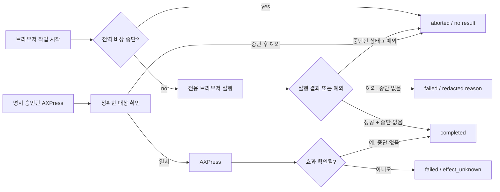

# Alden 독립 브라우저·macOS AX 도구 비상 중단 귀속 — 2026-10-11

## 소스 기준과 변경 범위

기준 원격 코드: PR #31 `0b9ceac7b5e93d093043ea406b742d3b4e5274ff`.
분리 검토 브랜치: `codex/alden-tool-cancel-attribution-20261011`.
PR #27→#28→#29→#30→#31→이 변경의 스택을 유지하고 병합하지 않는다.
지정 Mac 복제본, 원본·사용자 파일, 활성 DB/전송 큐, 모델과
운영 서비스는 원격 GitHub 소스 변경으로 손대지 않았다.

## 실제 제품 변경

`scripts/alden_tool_runtime.py`의 `run_browser`에서 브라우저
컨텍스트가 global abort에 의해 닫히며 예외가 나는 경우를
`browser_job_failed`로 잘못 보고하지 않는다. 현재 토큰의
중단 상태를 검사하여 `ToolStatus.ABORTED`와
`AX_ABORT_GLOBAL`만 내보내고 비공개 exception 내용·작업
문구·반환 문자열은 노출하지 않는다. 이 상태는 외부 웹사이트의
선행 부작용이 롤백됐다는 뜻이 아니다.

`run_exact_ax`는 입력된 타깃을 resolve할 때 **아직
`perform_exact`를 호출하기 전** 전역 중단이 발생하고
FocusStealRequired·대상 오류·기타 예외를 수신한 경우
`ABORTED`로 통일한다. 기존 opt-in·정확한 PID/role/identifier,
foreground/pointer 전환 금지 계약은 보존한다.

실제 AXPress 이후 토큰 중단이나 실행 오류는 버튼이 눌렸는지
확정할 수 없으므로 이미 있는 `AX_ERROR_EFFECT_UNKNOWN`을
계속 유지한다. 이를 취소 성공이나 재실행 가능 상태로 바꾸지
않고 안전한 사후 증거 대사를 요구한다.

## 테스트 범위와 한계

[macOS CI #38072772583](https://github.com/twoimo/alden/actions/runs/38072772583),
검증 SHA `ef94d51226314408fbcd8830f95d2728bb783cea`:
**Python 92/92 통과**. 대상별 비상 중단, browser context close,
브라우저 실패·비밀 정보 비노출, exact AXPress 미승인,
확정 누름 후 효과 미확인, 로컬 음성 턴 귀속을 검사한다.
전용 모의 Runner/AX adapter와 실제 AbortController를 사용했으나
사용자 Mac의 Accessibility 승인·실제 창·물리 클릭 증거는 아니다.

## 서로 다른 런타임의 전역 중단과 재개

추가 통합에서 음성 파이프라인과 독립 브라우저가 **같은**
`AbortController` epoch를 사용하는 동안 동시에 작업하도록
재현했다. Global emergency stop이 발행되면 지연된 모델 응답,
TTS/assistant 이력과 브라우저 결과를 모두 차단한다.
이후 명시적 `resume_after_human_action`은 과거 epoch 토큰을
되살리지 않고, 새 토큰으로 새롭게 시작한 세션만 성공한다.

`scripts/alden_voice.py`의 `_begin_turn`은 유효하지 않은
세션에서 새 사용자 입력·`turn_id`를 할당하지 않는다.
동기 `process_text/process_utterance`는 해당 입력을
`ABORTED`, `cancelled=true`로 정확히 반환한다.
입력 수신과 작업 큐 등록 사이의 중단 경합도
`_submit_turn`의 성공 boolean으로 연결해, 작업 큐에
등록되지 않은 요청을 `submit_text`가 성공했다고
보고하지 않도록 수정했다.

[macOS CI #38073524156](https://github.com/twoimo/alden/actions/runs/38073524156),
정확한 검증 SHA `80c8bc002404e9c77328ac9e1147dd3cf6a94dd4`:
**Python 94/94 통과**. `tests/test_alden_cross_runtime_abort.py`는
실제 `AldenVoicePipeline`, `AldenToolRuntime`,
`alden_history.database`, `AbortController`를 함께 실행한다.
네트워크 모델과 브라우저/스피커만 모의 객체이므로 이 결과는
실물 macOS 장치의 모델·AX·마이크 효과를 증명하지 않는다.
선행 실패 실행 `38073211690`은 테스트의 SQL 정렬 가정 오류로
분리해 보존했고, `38073277534`에서 교차 턴 93개 통과한
결과도 당시 커밋의 독립 증거로 남긴다.

## 실제 설치/릴리즈 게이트

Mac 네이티브 Core/Computer Use가 아직 사용 가능한 유효한
`turn_token`을 제공하지 않아 사용자의 작업 복제본,
`goal-objective.md` 원문과 `outputs/STATUS.md`, 물리 UI·
프로세스 상태를 재조회하지 못했다. 기존 산출물과 음성 모델
설정·데이터를 보존한 뒤 최신 스택의 정확한 소스를
검토·설치·서명·공증·운영 배포해야 한다.
이 GitHub 원격 CI는 비상 중단 직후 다른 Mac 앱의 실제 UI
효과가 없었음을 증명하지 못한다.
